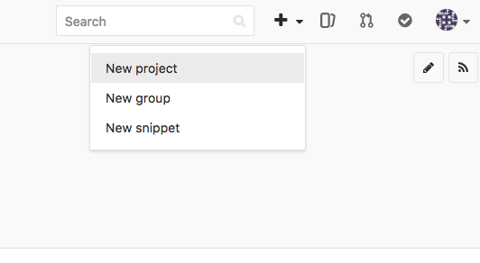
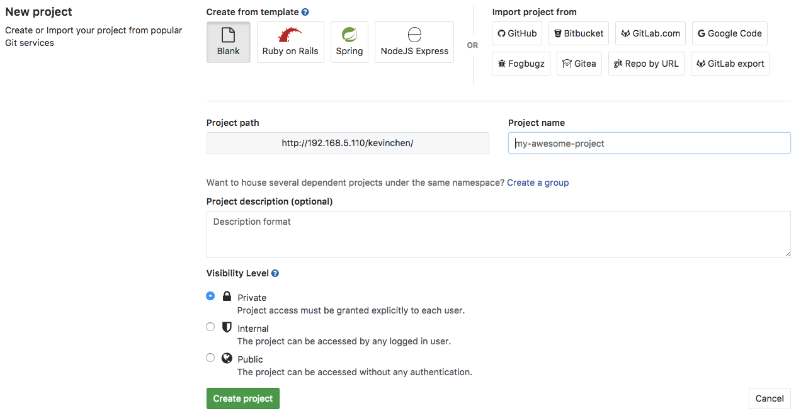
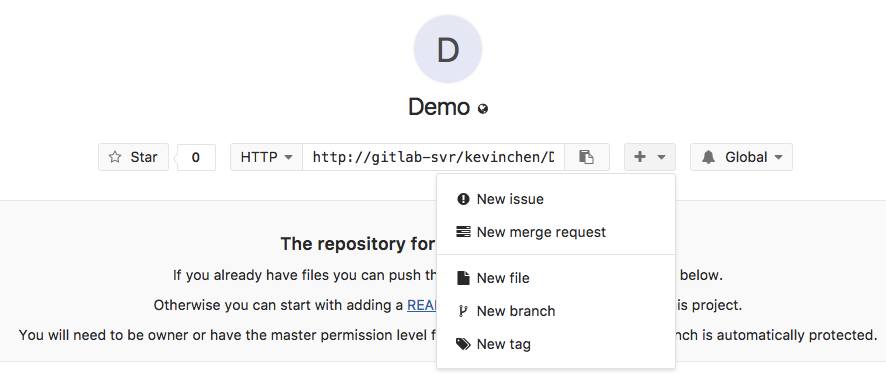
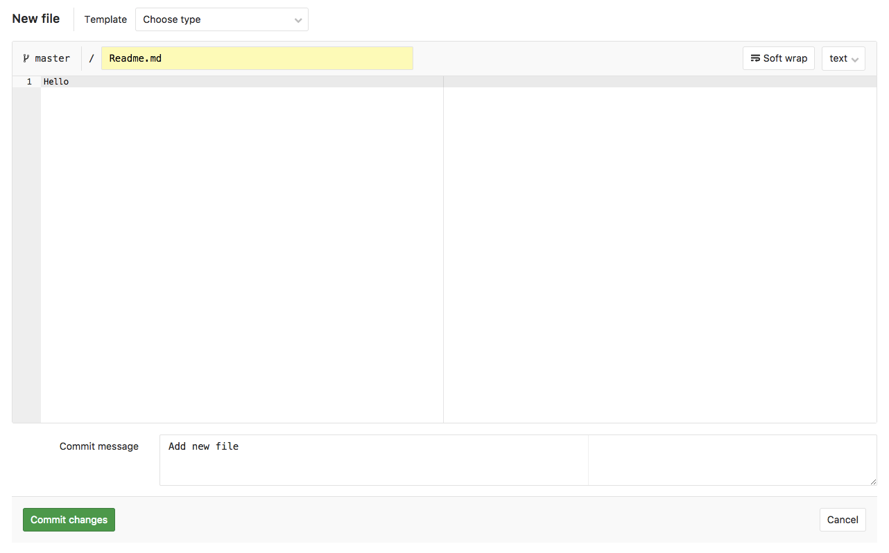
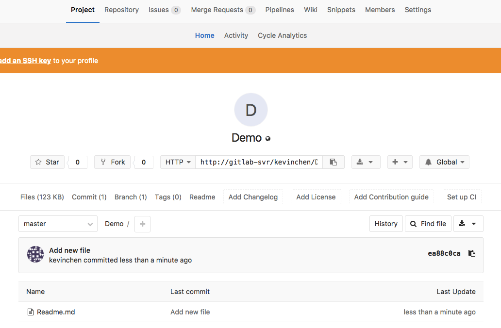

# Create New Project on GitLab

:::warning
注意 :zap:
* 以下流程只會說明在GitLab如何創建專案，至於GitLab其他頁面功能請自行摸索
:::

#### 1. 在註冊完帳號密碼後，就可以選擇``New Project``進行專案創建

---

#### 2. 輸入專案名稱，設定專案是否公開

---

#### 3. 專案建立完後，新增第一個檔案

---

#### 4. 新增一個Readme.md檔案，用途是用來說明專案流程或注意事項

---

#### 5. 新增完成後就可以利用git command line (或GUI) 將檔案上傳了

---