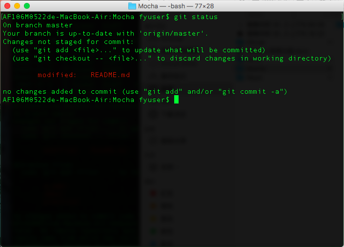

# Git Clinet Basic (for Windows)
Client 基本安裝設定與操作

> 訊息 :mega:
> * 若之後有需要mac環境的Git Client操作步驟再提供，不過若現在在Windows就學習用Command Line，以後不管環境是mac或linux，CLI都是一樣的，就不用擔心相同軟體在不同環境的支援性

> ## 警告 :fire: ：在每一次push git server請一定要寫log message，格式：``年_月_日 功能名稱：詳細描述修改過程或原因``，例如：``2017_08_28 修改下單功能：把下單流程從如此如此改成這般這般``，不要嫌麻煩，就當提醒自己那天改了什麼，避免上級詢問時需要時間回想

 

> 注意事項 :zap:
> #### Git HTTP 協定的檔案大小限制
> 使用 git push 經由 HTTP 協定的時候要注意了，因為有檔案大小的限制，預設是 1MB。

> 有兩種方式可以解決這個問題：
> 1. 使用 SSH 來作為 git 的通訊。
> 2. 加大 HTTP 檔案大小限制，如下：
> ``git config http.postBuffer 524288000`` #Set to 500MB

## Step 1 : Install Git
請到[Git官網](https://git-scm.com/downloads)下載適合自己環境的Git Client，並將其安裝完成 (安裝過程在此就不詳述，與安裝一般軟體雷同)

## Step 2 : Register
用GitLab管理員提供的IP位址開啟網頁，並註冊GitLab會員，切記請記住``username`` & ``password``，在下個步驟會用到

## Step 2 : Initial Git for Project

> 注意事項 :zap:
> * 此步驟是用Command Line的方式進行操作，若需要GUI，請上網找尋適合自己的軟體
> * 以下的操作指令只是Git Client的簡單操作，若想了解更多指令與操作方式，請參考[Git官網教學](https://git-scm.com/book/zh-tw/v1/%E9%96%8B%E5%A7%8B)
> * Demo環境為mac，所以在此Windows安裝Git的圖示就不提供了

1. 在專案的資料夾點右鍵選擇 ``Git Bash Here``，開啟終端機畫面 (資料夾位置與名稱自訂)
2. 在終端機輸入指令，為第一次Git初始化與下載程式碼，指令：``git clone "專案位址"``， (ex : ``git clone https://github.com/CruiseAndy/Webpack.git``，專案位址請專案管理員提供)
3. 在下載的過程中會需要輸入上一步驟所設定的``username`` & ``password``

## Step 3 : Basic Operate

> 注意事項 :zap:
> * 以下指令只是簡單的基礎操作，在不同的情況下可能需要用不同的參數或指令

* 更新本地檔案：每次修改與上傳檔案前，請更新本地端的檔案，``git pull "專案路徑"``

---

* 暫存修改檔案：在local commit前，需要暫存已修改過的檔案，``git add "filename"``

---

* 本地提交檔案：提交所有暫存的檔案，``git commit -a``

``commit log message``

---

* 上傳檔案：上傳已提交之檔案，``git push --all "專案路徑"``

---

* 檢視檔案的狀態：檢視目前本地專案的檔案狀態，``git status``

