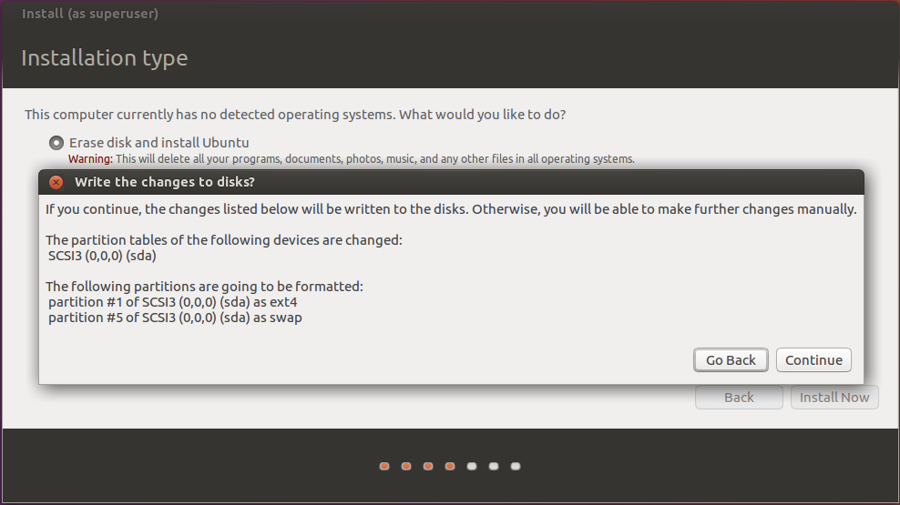

# GitLab Installation

## Step 1 : Install Linux

請到[Unbuntu](https://www.ubuntu-tw.org/modules/tinyd0/)官網下載Unbuntu桌面版本

之後請依環境情況安裝軟體（虛擬機或實體機），然後依照以下圖示進行設定

---

### 1. 選擇``Install Unbuntu``

---

### 2. 選擇``Continue``

----

### 3. 選擇``Erase disk install Ubuntu``，再點選``Install Now``

---

### 4. 選擇``Continue``

---

### 5. 選擇時區（輸入Taiwan）

---

### 6. 選擇鍵盤

---

### 7. 設定使用者名稱與密碼（自訂）

---

### 8. 安裝結束後重開機

---

## Step 2 : Install GitLab

請開啟終端機（Terminal），輸入``sudo apt-get update``進行套件列表更新，接下來依照以下圖示進行GitLab安裝

1. 輸入CLI，``sudo apt-get install curl openssh-server ca-certificates postfix -y``  

2. 按左/右選擇OK  

3. 按左/右選擇OK  

4. 按左/右選擇OK  

5. 輸入CLI，``curl -sS https://packages.gitlab.com/install/repositories/gitlab/gitlab-ce/script.deb.sh | sudo bash``進行套件下載  

6. 輸入CLI，``sudo apt-get install gitlab-ce``進行套件安裝  

7. 輸入CLI，``sudo gitlab-ctl reconfigure``啟動GitLab  

8. 啟動成功  

## Step 3 : Connect GitLab

依照不同環境查詢本機IP，利用瀏覽器開啟IP位址即可進入GitLab頁面