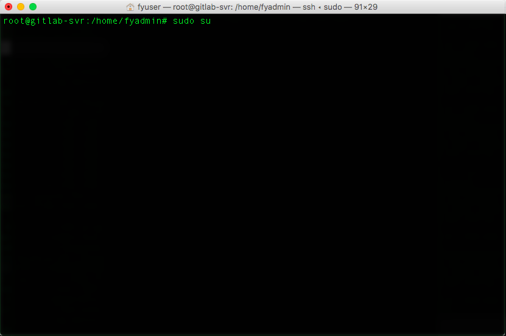
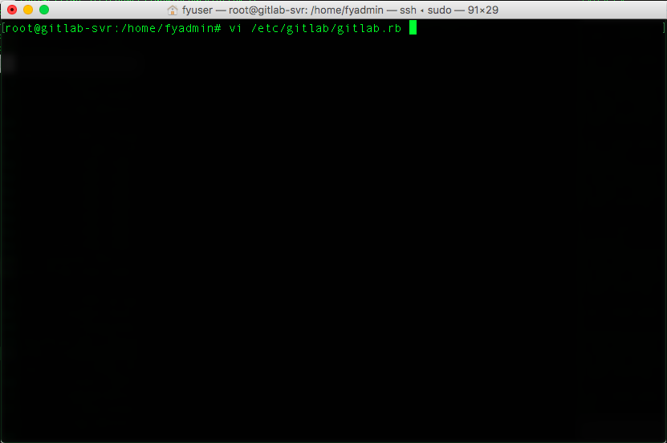
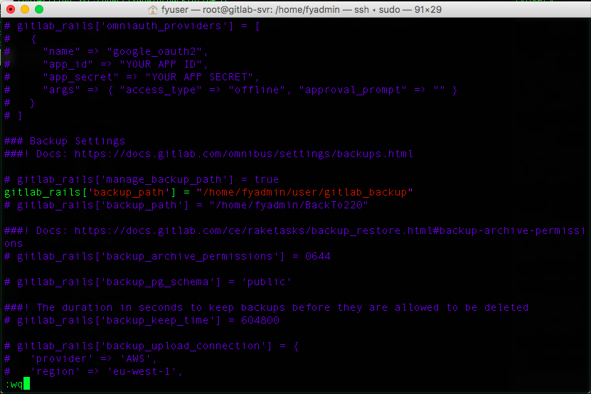
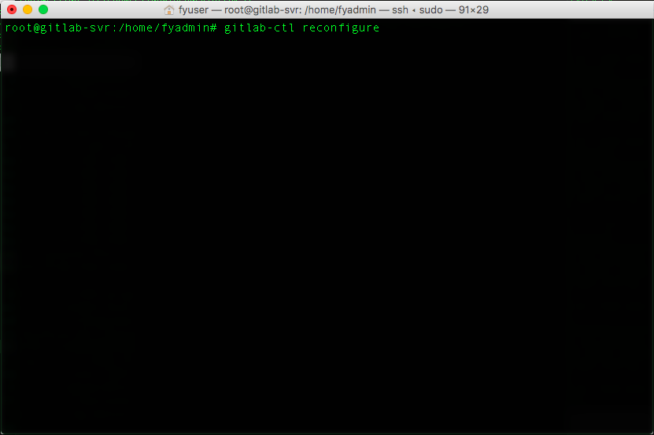
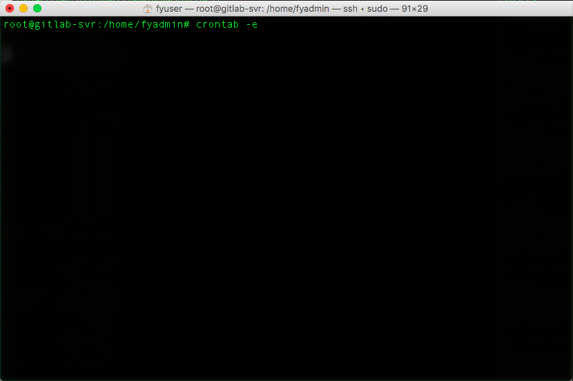
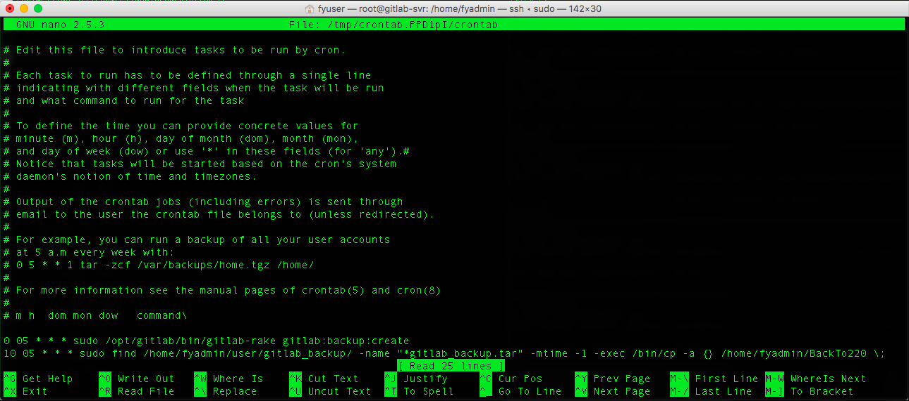

# GitLab Server Backup & Restore

## Backup

> 注意 :zap:
> * 以下操作請在``GitLab Server``操作步驟

#### 1. 請先登入root權限，``sudo su``  

#### 2. 修改gitlab.rb檔，``vi /etc/gitlab/gitlab.rb``  

#### 3. 修改gitlab_rails['backup_path'] ＝ "備份路徑"  
> 訊息 :mega:
> 溫馨提醒
> * 快速尋找字串：``/ + "search string" ``
> * 進入修改模式：點選鍵盤上的``i``
> * 離開修改模式：點選鍵盤上的``esc``
> * 儲存離開檔案：``shift + 冒號``，輸入``wq``，按``enter``（write & quit）

#### 4. 重啟configure  

> 注意 :zap:
> * 若在重啟的過程中出現錯誤訊息
> ``Error executing action `create` on resource 'directory[/mnt/BackupServer/gitlab_backup]'``，表示備份的路徑會有權限上的問題，請回到步驟三將路徑做修改（找一個沒有問題的路徑），再依照步驟7的注意事項解決問題

#### 5. 重啟GitLab  

#### 6. 新增定時備份指令  

#### 7. 在檔案最後新增指令，``0 05 * * * sudo /opt/gitlab/bin/gitlab-rake gitlab:backup:create``  
> 訊息 :mega:
> 前五個參數代表意義
> * 分：0-59
> * 時：0-23
> * 日：1-31
> * 月：1-12
> * 週：0-7
> 詳情可參考[鳥哥的教學](http://linux.vbird.org/linux_basic/0430cron.php)

> 注意 :zap:
> 若在步驟4出現路徑權限的問題，請在檔案最後再加上一行指令，方法是先將檔案備份到暫存的路徑，再從暫存路徑將檔案複製到實際儲存的路徑，指令如下
> ``10 05 * * * sudo find /home/fyadmin/user/gitlab_backup/ -name "*gitlab_backup.tar" -mtime -1 -exec /bin/cp -a {} /home/fyadmin/BackTo220 \;``

## Restore

#### 1. 複製要還原的備份檔

> sudo cp 1503648028_2017_08_25_9.5.0_gitlab_backup.tar /var/opt/gitlab/backups/

#### 2. 停止GitLab Service

> sudo gitlab-ctl stop unicorn
> sudo gitlab-ctl stop sidekiq

#### 3. 指定還原的備份檔

> sudo gitlab-rake gitlab:backup:restore BACKUP=1503630677_2017_08_25_9.5.0

#### 4. 啟動GitLab

> sudo gitlab-ctl start

#### 5. 確認GitLab

> sudo gitlab-rake gitlab:check SANITIZE=true

詳情請參考[這裏](http://mycodetub.logdown.com/posts/260395-gitlab-backup-restore-settings-notes)