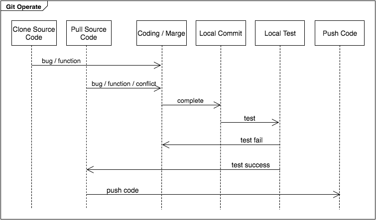
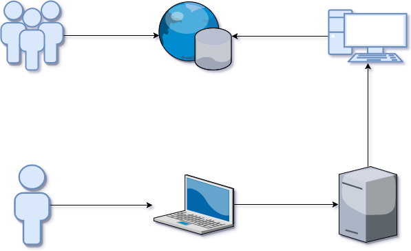

# 此專案主要提供以下教學

* GitLab Installation

* Git Clinet Basic (for Windows)

* Create New Project on GitLab

* Backup & Restore

## 提供以下流程圖，讓大家可快速了解操作流程

#### * Git流程圖：有點需要加強宣導，在push code前，請一定要pull source code，確保local端的程式碼是最新的，且程式碼沒有衝突才能將程式碼push到git server

#### * 公司IT流程圖

> 1. RD利用個人電腦開發專案，並將專案上傳至Git Server
> 2. 在測試機架設Git Client，並將程式碼下載至測試機進行測試
> 3. 在測試機確認專案可以正常執行後，利用人工的方式將程式碼放置正式機
> 4. 外部的使用者透過網路連線至公司的正式機進行相關操作

